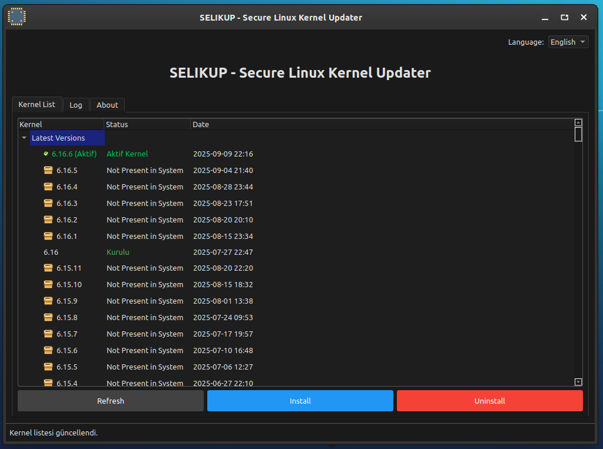
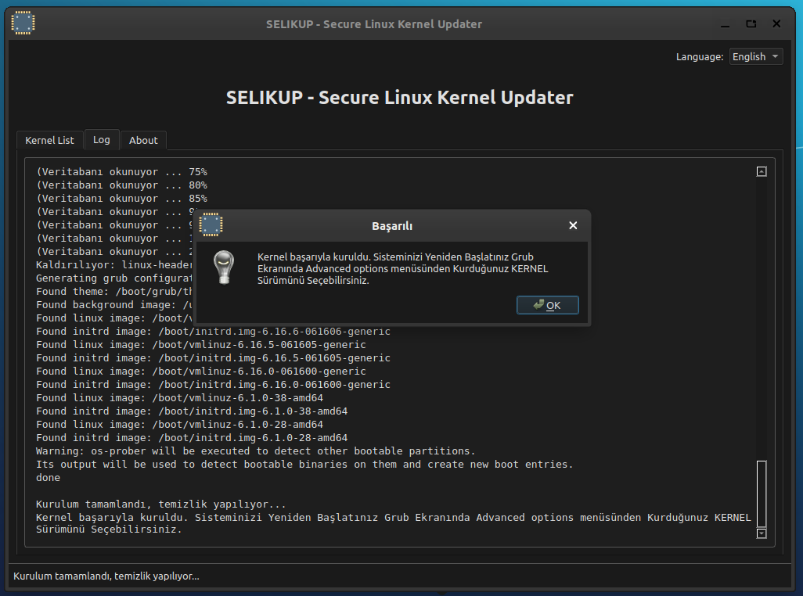

<a href="#">
    
</a>

# SELIKUP
SELIKUP (Secure Linux Kernel Updater), This program helps you update your Linux distribution's Linux kernel by downloading the kernel from the KERNEL main repository.

<h1 align="center">selikup Logo</h1>

<p align="center">
  
</p>

----------------------------------

# Linux Screenshot
  
  
  
  
  
--------------------
Install Git Clone and Python3

Github Package Must Be Installed On Your Device..

git
```bash
sudo apt install git -y
```

Python3
```bash
sudo apt install python3 -y 

```

pip
```bash
sudo apt install python3-pip

```

----------------------------------


# Installation
Install SELIKUP

```bash
sudo git clone https://github.com/cektor/selikup.git
```
```bash
cd selikup
```

```bash
python3 selikup.py

```

# To compile

NOTE: For Compilation Process pyinstaller must be installed. To Install If Not Installed.

pip install pyinstaller 

Linux Terminal 
```bash
python3 -m pyinstaller --onefile --windowed selikup.py
```


# To install directly on Linux


Linux (based debian) Terminal: Linux (debian based distributions) To install directly from Terminal.
```bash
wget -O Setup_Linux64.deb https://github.com/cektor/selikup/releases/download/1.0.1/Setup_Linux64.deb && sudo apt install ./Setup_Linux64.deb && sudo apt-get install -f -y
```


Release Page: https://github.com/cektor/selikup/releases/tag/1.0.1

